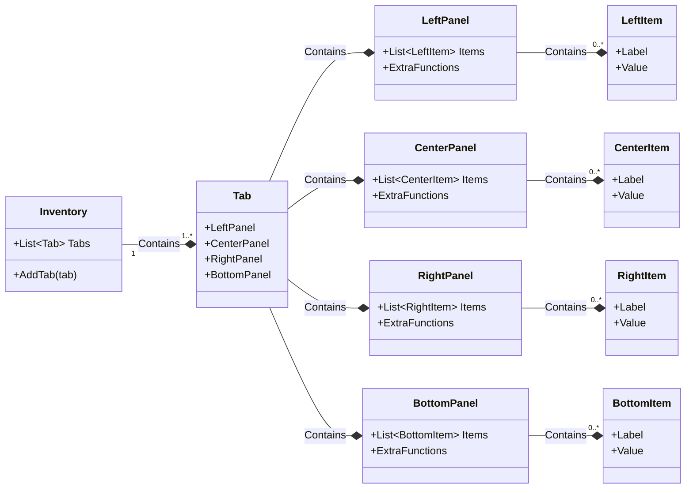

# Brynhildr 3D Inventory API

The **Brynhildr 3D Inventory API** provides developers with a flexible and modular way to build interactive inventory systems inside GTA V using Scaleform.  
Unlike traditional flat UIs, this system renders the inventory in **3D space**, allowing complete freedom in how and where the interface is drawn.  

The API is designed with the following goals in mind:

- **Modularity** – Tabs, columns, panels, and grid items are separated into distinct components, so you can mix and match them depending on your project needs.  
- **Developer Control** – The API focuses purely on the logic and UI building blocks. The actual rendering (`DrawScaleformMovie3D`) is intentionally left out, so you decide how and when the inventory is drawn.  
- **Flexibility** – Support for different layouts, such as 8x5 grids, dual grids, and multiple panel types (stats, details, equipment, etc.).  
- **Ease of Use** – The API follows a consistent design, created and learned with `ScaleformUI`, with functions documented through EmmyLua annotations, making it easier to explore and extend.

## What’s Included

- **Grid Items** – The basic building blocks of the inventory.  
- **Tabs & Columns** – Predefined layouts (8x5, 5x5, dual grid) to structure items.  
- **Panels** – Contextual information such as stats, details, and equipment.  
- **Context & Instructional Buttons** – Tools to provide feedback and player guidance.  
- **Inventory Core** – The main entry point that links all components together.  

## Inventory structure



## Example Usage

```lua
local inventory = Inventory.New()
local tab8by5 = Grid8by5.New("Tab 8 by 5", "texture dictionary", "texture name")
inventory:AddTab(tab8by5)
inventory:Visible(true)
```